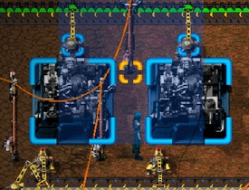
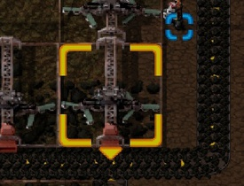
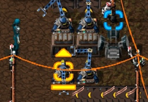

# Friday Facts #1

## 2013-09-27, [Tomas](https://factorio.com/blog/author/Tomas)

---

안녕하세요,

최근 저희는 포럼에서 커뮤니티와의 소통에 대해 많은 논의를 가졌습니다. 자세한 내용은 [여기](https://forums.factorio.com/forum/viewtopic.php?f=5&t=1239)에서 확인할 수 있습니다. 결과적으로 우리는 진행 상황에 대한 업데이트를 제대로 제공하지 못했다는 것을 깨달았고, 저희는 그것을 바꾸기로 결정했습니다.

이것은 "Factorio Friday Facts" 시리즈의 첫번째 포스트입니다. 매주 금요일 저희는 저희의 주간 진행 과정을 여기에 정리할 것입니다. 여기에는 저희가 작업해온 것, 계획하고 있는것, 그리고 때때로 인디 게임 개발자들이 사는데 있어서 재밌는 사실들이 포함됩니다.

좋습니다. 이제 지난 주에 무슨 일이 있었는지 알아봅시다. 팀 전체는 0.7.0 릴리즈를 완료하기 위해 집중했습니다. 이 릴리즈는 지금까지 가장 많은 개발 시간이 소요되었습니다. 그것은 부분적으로는 연휴 이후 우리가 관심을 받고 있었고 부분적으로는 해야 할 일이 **정말** 많았기 때문입니다:) 사실 대부분의 변화는 비밀이지만 (전투 프레임워크, 인공지능 루틴, 오염 모델링, 기타 등등) 그것들의 결과는 게임 내에서 보일 것입니다.

무엇이 바뀌었는지 살짝 알아봅시다. 가장 큰 변화는 아마 적 로직의 전반적인 변화일 것입니다. 이전에는 그들은 단순히 시나리오 이면에 있는 lua 스크립트에 의해 행동했습니다. 이제 그들은 좀 더 자율적이고 게임에 통합되어 움직입니다. 이것은 저희가 새로 도입한 '오염' 덕분입니다. Pollution is produced by the factory (mining drills, furnaces, etc.) and then spreads in the world. Some objects can actually lower pollution (for now only trees). After a while the deadly pollution clouds arrive to the enemy spawners. The spawners "clear" the pollution but in turn produce an "angry" biters (new name for our basic class of enemies). After certain period of time, all the angry biters from the local neighborhood are sent together to the closest local optimal pollution source to destroy everything that they find there. This follows a simple logic: you destroy their environment - they get angry - they attack you / your machines. For now there is no way to deal with the pollution in the "peaceful" way, but there will be in the future. You can imagine pollution clearing machines or even making pacts with enemies to tolerate pollution in exchange for providing them with supply of resources. Anyway this changes the game significantly. It is not enough to fortify the labs / radars now. You need to protect your whole factory / keep checking the pollution levels and examine from which direction the attack will come (the pollution is visible on the map after pressing the alt key).

For Albert (our graphic) the release has been especially challenging because after months of working on machine design he had to completely shift his style and model the enemy units and structures. The result are three new biters and three worms taking up a lot of MBs in the package:) Last week Albert spent with the most difficult structure - the enemy spawner. In the end we didn't put it into the release, because it still needs to be tweaked and better integrated, but it is definitely coming in one of the following bugfix releases. Apart from that Albert also spent some time preparing a new set of selection boxes and arrows. He was correct that the old ones "were hurting the eyes". You can check an example of new boxes in the screenshot below (personally I am really fond of them, that is why I share them here).

  

Since the release is rather big we have spent the last week mostly by fixing bugs and solving small remaining issues. AI behaviors are especially tricky to test because they are often not exact or easily reproducible. The final count of solved issues in the 0.7.0 has stopped at symbolic 111. Couple of them done at the very last moment:) After this sprint we will now take some rest over the weekend and start preparing the plans for the next update. Next month will be especially interesting because we will start actively preparing for the Steam greenlight campaign. This will require further graphical polishing in the game (namely player animation) and most importantly a new trailer. We already have couple of ideas and for sure we will discuss them with the community on the forums.

And finally the fun fact. During release compilation on our Linux virtual machine we got an error: "Virtual memory exhaust, cannot allocate more memory". Factorio code is getting really big. So there is no Linux build until we fix this:|

Well that would be it for now. The 0.7.0 release is actually out already, you can read more details on our [forum](https://forums.factorio.com/forum/viewtopic.php?f=3&t=1295) . It is still experimental and it will probably take some time before it stabilizes, but if you don't mind the bugs then go ahead and give it a spin.
