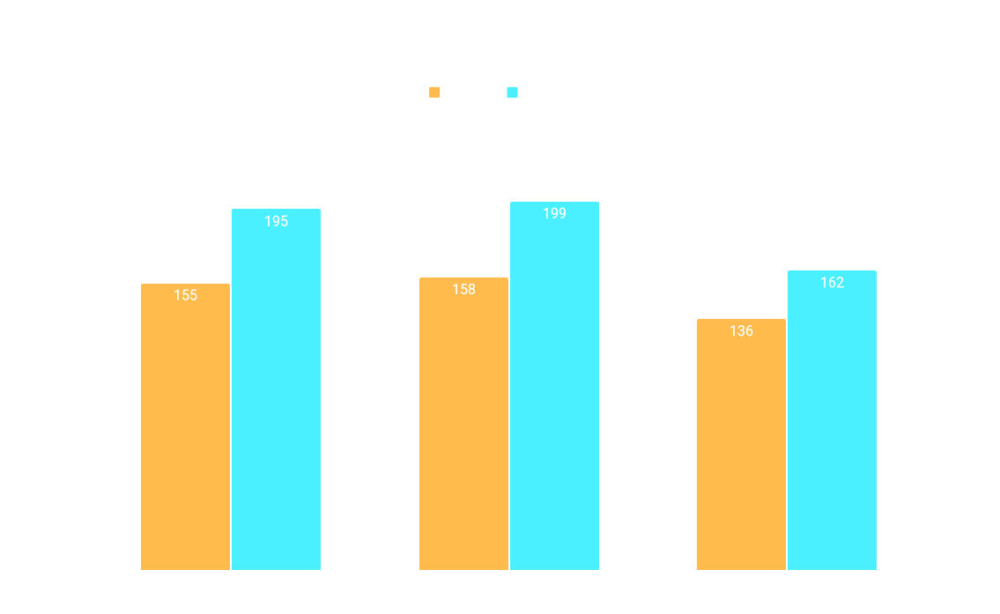

# Friday Facts #371

## 2022-11-25, [StrangePan](https://factorio.com/blog/author/StrangePan)

---

[원문 확인하기](https://factorio.com/blog/post/fff-371)

안녕하세요 여러분! 저는 Wube에 새로 입사했고 최근 1년동안 확장 컨텐츠 관련 일을 하고 있습니다. 오늘, 저는 저희 Mac 플레이어들을 위한 신나는 비-확장 뉴스를 가져왔습니다.

---

## 팩토리오가 Apple Silicon에서 구동되다

버전 1.1.71에서, 팩토리오는 Apple Silicon Mac의 네이티브 환경에서 실행됩니다! 이 기기들에서, 이전 버전에 비해 게임은 더 빠르고, 전력 소모를 덜 하며 구동되어야 합니다. 여러분은 메인 메뉴의 좌상단 구석에서 바이너리 버전을 확인할 수 있습니다. 

 

이것은 나오는데 오래 걸렸지만, 저희는 이런 개선을 구현하는데 있어 좋은 위치에 있지 못했습니다. 지금까지는 말이죠... 

### 동기

지난 2월, 저는 미국에서 처음으로 프라하에 있는 Wube 사무실에 방문했습니다. 비행기를 기다리며, 저는 저의 Intel Macbook Pro에서 팩토리오로 일을 하려고 결정했습니다. 30분이 지났고, 저의 노트북은 배터리가 반도 남지 않았습니다. 저에게는 22시간이 아직 남았고, 올해 계획된 더 많은 시간의 여행과 해야 할 일이 있었습니다.

저는 그 자리에서 즉시 Apple Silicon Macbook을 주문했습니다.

그것이 도착했을 때, 저는 배터리 수명에 감명받았습니다. 저는 드디어 제가 어디에 있든 팩토리오에서 편하게 일할 수 있게 되었습니다. 더 중요한 것은, 제가 어디에 있든 공장은 성장할 수 있습니다. 하지만 저는 거기에서 만족하지 못했습니다. 소프트웨어 엔지니어, 그리고 팩토리오의 엔지니어로서, 저는 저 스스로에게 물어야 했습니다. "내가 Apple Silicon 네이티브 지원으로 팩토리오를 더 오래 할 수는 없을까?"

### 개발

첫번째로 해결해야 할 문제는 멀티플레이 결정론이었습니다. 팩토리오의 arm64 버전과 x86_64 버전이 동일하게 동작하는지 확인하는 것은 멀티플레이가 작동하기 위해 매우 중요합니다. 운이 좋게도 그때, Twinsen이 이미 닌텐도 스위치를 위한 포트를 개발 중에 있었고 [(FFF-370)](https://factorio.com/blog/post/fff-370), 크로스플랫폼 멀티플레이를 지원하기 위한 그의 계획을 저에게 공유해주었습니다. 그래서 저는 지금은 걱정할 필요가 없었죠.

닌텐도 스위치를 위한 포트의 개발은 극비로 진행되었습니다. 심지어 팩토리오의 소스 코드에 액세스 할 수 있는 커뮤니티 회원조차도 알 수 없었죠. 그래서, 그 포트가 개발되고 있다는 사실이 유출되는 것을 막기 위해, 저는 이 프로젝트에서 작업하는 것을 발표때가지 미뤘습니다. 그리고 10월 19일, 다시 시작할 때가 되었습니다. 

다음으로, 저희는 저희의 macOS 빌드 과정을 안내해야 했고, 저희의 과정은 수년간 검토되지 않았습니다. macOS 빌드는 ARM 아키텍처를 위해 포팅하기 어려운 몇 가지 시간 소모적인 단계를 포함하고 있으며 오래된 컴파일러 버전을 사용하고 있었습니다. 몇 가지 시행착오를 겪으면서, 팩토리오의 Mac 빌드 지침을 다시 작성하고 단순화했으며 팩토리오 개발을 위한 새 Mac을 설정하는 시간을 (인터넷 연결 상태에 따라) 몇 시간에서 몇 분으로 단축했습니다.

보다 간소화되고 표준화된 빌드 프로세스를 통해 ARM을 지원하기 위해 저는 빌드 규칙을 업데이트하기 시작했습니다. 이 부분은 단순했습니다. 이미 여러 아키텍처를 지원하도록 구조화되었기 때문에, x86-64 아키텍처와 함께 ARM 아키텍처를 추가하고 몇 개의 깨진 플래그를 수정했습니다. 저는 범용 macOS 바이너리를 생성하기 위한 몇 가지 새로운 빌드 규칙을 입력했습니다 (매우 쉬웠습니다). 그리고 곧 Apple Silicon과 Intel Mac 모두에서 네이티브로 실행되는 Factorio의 기능하는 버전이 나왔습니다!

마지막 과제는 구축이었습니다. 저희 macOS 빌드 서버는 x86-64 CPU를 사용하기 때문에, 저는 팩토리오의 x86-64와 arm64 버전을 단일 x86-64 머신에서 컴파일하는 방법을 알아내야 했습니다. 컴파일러와 링커는 잘 작동했지만, ARM용 C++ 라이브러리를 얻는 것은 의외로 필요 이상으로 어려웠습니다. 많은 실험 끝에, 가장 일관되게 작동하는 단계를 발견하고 홈브루에서 arm64 C++ 라이브러리를 다운로드하여 수동으로 "설치"하는 사용자 지정 BASH 스크립트를 작성했습니다. 이것은 전체 프로세스에서 가장 까다로운 부분이지만 대부분의 개발자는 이 작업을 수행할 필요가 없습니다.

종합적으로, macOS의 새 빌드 과정을 조사하고, 개발하고, 테스트하고, 배포하는데까지는 약 4주 정도 소요되었습니다. 

### 성능 향상

After we had a functioning universal binary, we ran benchmarks and conducted manual tests to see what improved.

We ran benchmarks on 3 different Apple Silicon machines, using the same compiled release binary and run settings. We used the famous flame_Sla 10k map and averaged our results. Here is a summary of our findings:

Overall, we observed that the arm64 version of Factorio performed 19%-25% better in our benchmarks than the x86_64 version.

We even compared runs between macOS 10.13.6 High Sierra, 12.6.1 Monterey, and 13.0 Ventura. We observed no notable performance difference between these OS versions. The differences we observed were all less than 10% and did not consistently favor any particular version.

In addition to running benchmarks, I did a couple very unscientific tests on my laptop (MacBook Pro 14-inch 2021, Apple M1 Max, 64 GB) to check FPS and energy consumption:

x86_64: Average FPS: 37; Energy Impact: 5,270
arm64: Average FPS: 45; Energy Impact: 4,545

*Energy Impact is calculated by [Activity Monitor](https://support.apple.com/ko-kr/guide/activity-monitor/actmntr43697/mac) and is purportedly "a relative measure of the current energy consumption of the app (lower is better)".

### 감사의 인사

새 빌드의 도움을 주고, 문제 해결과 테스트에 도움을 준 저의 동료 Therenas, 커뮤니티 회원 Xorimuth, 그 외 소스 코드에 액세스 할 수 있는 분들께 감사의 인사 드립니다. 그리고 배포 시스템을 업데이트하는 데 있어 인내와 도움을 준 동료 Sanqui와 ARM 지원에 있어 탁월한 작업을 보여준 Twinsen에게도 감사합니다.

### 결론

지난 주말, 저는 Macbook을 완전히 충전하고 가장 최근의 확장 플레이에서 저희 팀이 구축한 메가 베이스를 열었습니다. 저는 제조 문제를 해결하고 물류 문제를 해결하며 공장을 확장하고 방어를 구축하는 일을 시작했습니다. 저는 재충전이 필요하기 전에 세 시간 반 동안 우리가 만든 영광스러운 혼란 속에서 길을 잃었고, 제 게임은 내내 편안한 60 FPS로 실행되었습니다.

팩토리오 플레이어는 공장을 구축할 때 해결해야 할 병목 현상이 많습니다. 이제 노트북의 배터리가 그들이 걱정해야 할 병목 현상을 한 번 줄였으면 합니다.

다음에 또 봅시다!