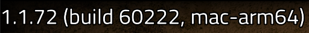

# Friday Facts #371

## 2022-11-25, [StrangePan](https://factorio.com/blog/author/StrangePan)

---

[원문 확인하기](https://factorio.com/blog/post/fff-371)

안녕하세요 여러분! 저는 Wube에 새로 입사했고 최근 1년동안 확장 컨텐츠 관련 일을 하고 있습니다. 오늘, 저는 저희 Mac 플레이어들을 위한 신나는 비-확장 뉴스를 가져왔습니다.

---

## 팩토리오가 Apple Silicon에서 구동되다

버전 1.1.71에서, 팩토리오는 Apple Silicon Mac의 네이티브 환경에서 실행됩니다! 이 기기들에서, 이전 버전에 비해 게임은 더 빠르고, 전력 소모를 덜 하며 구동되어야 합니다. 여러분은 메인 메뉴의 좌상단 구석에서 바이너리 버전을 확인할 수 있습니다. 

 

이것은 나오는데 오래 걸렸지만, 저희는 이런 개선을 구현하는데 있어 좋은 위치에 있지 못했습니다. 지금까지는 말이죠... 

### 동기

지난 2월, 저는 미국에서 처음으로 프라하에 있는 Wube 사무실에 방문했습니다. 비행기를 기다리며, 저는 저의 Intel Macbook Pro에서 팩토리오로 일을 하려고 결정했습니다. 30분이 지났고, 저의 노트북은 배터리가 반도 남지 않았습니다. 저에게는 22시간이 아직 남았고, 올해 계획된 더 많은 시간의 여행과 해야 할 일이 있었습니다.

저는 그 자리에서 즉시 Apple Silicon Macbook을 주문했습니다.

그것이 도착했을 때, 저는 배터리 수명에 감명받았습니다. 저는 드디어 제가 어디에 있든 팩토리오에서 편하게 일할 수 있게 되었습니다. 더 중요한 것은, 제가 어디에 있든 공장은 성장할 수 있습니다. 하지만 저는 거기에서 만족하지 못했습니다. 소프트웨어 엔지니어, 그리고 팩토리오의 엔지니어로서, 저는 저 스스로에게 물어야 했습니다. "내가 Apple Silicon 네이티브 지원으로 팩토리오를 더 오래 할 수는 없을까?"

### 개발

첫번째로 해결해야 할 문제는 멀티플레이 결정론이었습니다. 팩토리오의 arm64 버전과 x86_64 버전이 동일하게 동작하는지 확인하는 것은 멀티플레이가 작동하기 위해 매우 중요합니다. 운이 좋게도 그때, Twinsen이 이미 닌텐도 스위치를 위한 포트를 개발 중에 있었고 [(FFF-370)](https://factorio.com/blog/post/fff-370), 크로스플랫폼 멀티플레이를 지원하기 위한 그의 계획을 저에게 공유해주었습니다. 그래서 저는 지금은 걱정할 필요가 없었죠.

닌텐도 스위치를 위한 포트의 개발은 극비로 진행되었습니다. 심지어 팩토리오의 소스 코드에 액세스 할 수 있는 커뮤니티 회원조차도 알 수 없었죠. 그래서, 그 포트가 개발되고 있다는 사실이 유출되는 것을 막기 위해, 저는 이 프로젝트에서 작업하는 것을 발표때가지 미뤘습니다. 그리고 10월 19일, 다시 시작할 때가 되었습니다. 

다음으로, 저희는 저희의 macOS 빌드 과정을 안내해야 했고, 저희의 과정은 수년간 검토되지 않았습니다. macOS 빌드는 ARM 아키텍처를 위해 포팅하기 어려운 몇 가지 시간 소모적인 단계를 포함하고 있으며 오래된 컴파일러 버전을 사용하고 있었습니다. 몇 가지 시행착오를 겪으면서, 팩토리오의 Mac 빌드 지침을 다시 작성하고 단순화했으며 팩토리오 개발을 위한 새 Mac을 설정하는 시간을 (인터넷 연결 상태에 따라) 몇 시간에서 몇 분으로 단축했습니다.

With a more streamlined, standardized build process, I set to work updating our build rules to support ARM. This part was simple; they were already structured to support multiple architectures, so I simply added the ARM architecture alongside the x86-64 architecture and fixed a few broken flags. I threw in a few new build rules for generating a universal macOS binary (which was extremely easy), and soon we had a functioning version of Factorio that ran natively on both Apple Silicon and Intel Macs!

The final challenge was deployment. Our macOS build server uses an x86-64 CPU, so I needed to figure out how to compile both the x86-64 and the arm64 versions of Factorio on a single x86-64 machine. Our compilers and linkers worked just fine, but obtaining the C++ libraries for ARM was surprisingly more difficult than it needed to be. After a lot of experimenting, I found the steps that worked most consistently and wrote a custom BASH script that downloads and manually "installs" the arm64 C++ libraries from Homebrew. This is the most hacky part of the whole process, but most developers will never need to do this.

In total, it took about 4 weeks to investigate, develop, test, finalize, and deploy the new macOS build process.